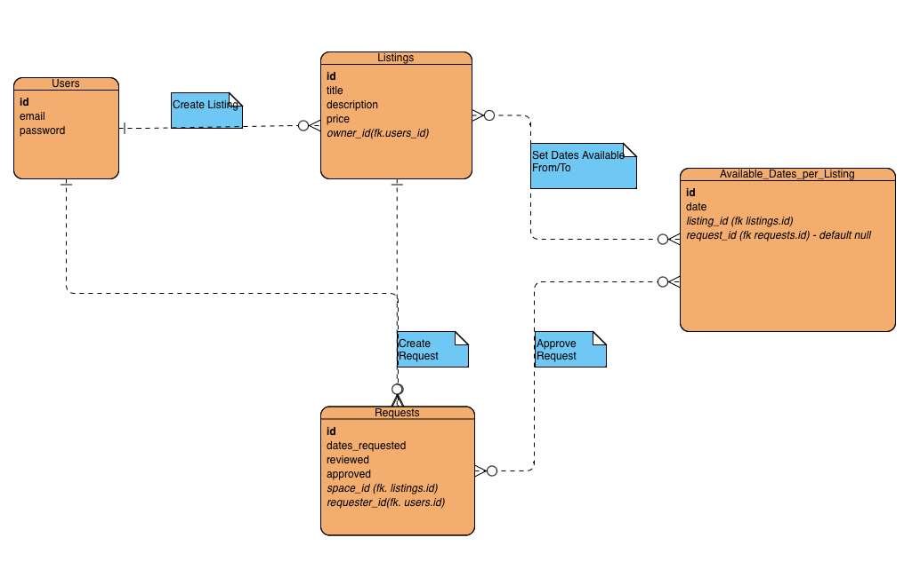
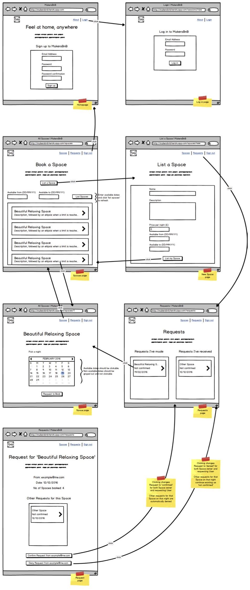

# Mbnb | AirBnb CLone Project

## Table of Contents

- [Description](#description)
- [My Extension]()
- [Demo](#demo)
- [What I Learned](#what-i-learned)
- [Getting Started](#getting-started)
- [Features](#features)
- [Contributors](#contributors)

# MakersBnB Python Project - Personal Extension

This is my person extension project for the Makersbnb Python/Flask project, made on Makers Academy's Software Engineering bootcamp.

This original group project primarily focused on our backend. For my extension, I wanted to practice using HTML and CSS to replicate a simplified version of the Airbnb UI.

# WIP Updates:

**29 October**

- Adds new homepage with self-made 'makersbnb' logo and transition background. I aim to adhere as much as possible to the 2014 Airbnb rebrand. All background images are stock images. All subsequent page designs will follow suit.

# Original Project README:

[Link to group project](https://github.com/clairep94/makers_project_airbnb_clone)

This is the first group project on Makers Academy's Software Engineering bootcamp.
This is a barebones crud app for Airbnb, created over one week through TTD, OOP, and Agile practices (pair programming, Kanban boards, etc.).

Original roject by Catherine Russell, Perran Thomas and Joseph.

The project aims were as follows:

* Learn to work and communicate effectively as part of a team to build a web application.
* Learn to break down projects into tasks and assign them to pairs.
* Learn to use agile ceremonies to organise your work and improve your processes.
* Learn to use the developer workflow to plan, implement and peer-review features.

Tech used:

* Python, Flask
* psycopg, PostgreSQL
* Playwright, Pytest
* Git, Github

## Getting Started

To run this application on your local machine, you'll need to install the necessary dependencies and configure your environment. Here's a step-by-step guide:

1. Clone the repository: `git clone <repository_url>`
2. Install the required Python packages: `pip install -r requirements.txt`
3. Set up your database and make any necessary configuration changes in the `config.py` file.
4. Start the Flask application: `python3 app.py`

Your Airbnb clone should now be accessible at `http://localhost:5000` in your web browser.

## Project Specification:

We would like a web application that allows users to list spaces they have available, and to hire spaces for the night.

### Headline specifications (provided in project brief)

- Any signed-up user can list a new space.
- Users can list multiple spaces.
- Users should be able to name their space, provide a short description of the space, and a price per night.
- Users should be able to offer a range of dates where their space is available.
- Any signed-up user can request to hire any space for one night, and this should be approved by the user that owns that space.
- Nights for which a space has already been booked should not be available for users to book that space.
- Until a user has confirmed a booking request, that space can still be booked for that night.

## Planning:

ER Diagram for simple Makersbnb relational database:

UI Mockups (provided in project brief):

