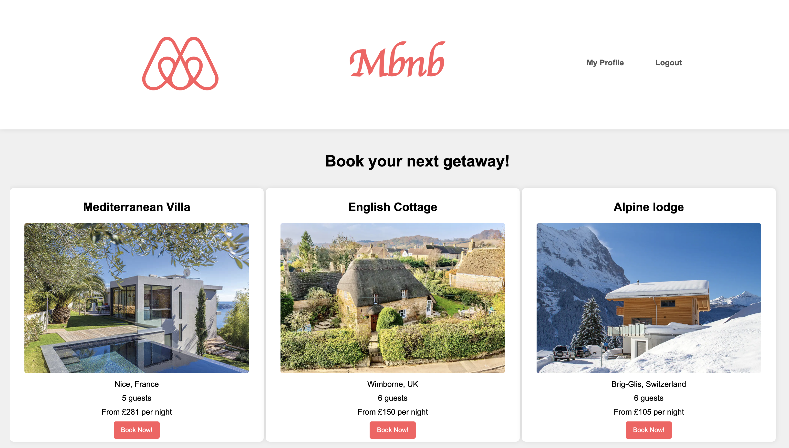

# Mbnb | Personal Extension from AirBnb Clone Group Project

## Contents

- [Project Description](#project-description)
- [Demo](#demo)
- [Features](#features)
- [Key Areas of Learning](#key-areas-of-learning)
- [How to Run the Application](#how-to-run-the-application)
- [Contributors](#contributors)

# Project Description

This is my personal extension for the Makersbnb Python/Flask project.

As the first group project of the Software Engineering bootcamp, the project aims were to develop both technical skills and learn to use the developer workflow to plan, implement and peer-review features. The original project was created over one week through TTD, OOP, and Agile practices (pair programming, Trello boards, etc.). 

This original group project primarily focused on our backend. For my extension, I wanted develop my HTML and CSS skills make it more visually appealing and closer resemble the AirBnB website.

Tech used:

* Python, Flask
* psycopg, PostgreSQL
* Playwright, Pytest
* Git, Github

[Link to original group project](https://github.com/jmiller84/bnb_team_2.git)

# Demo

# Features

Project Specification:
- Any signed-up user can list a new space.
- Users can list multiple spaces.
- Users should be able to name their space, provide a short description of the space, and a price per night.
- Users should be able to offer a range of dates where their space is available.
- Any signed-up user can request to hire any space for one night, and this should be approved by the user that owns that space.
- Nights for which a space has already been booked should not be available for users to book that space.
- Until a user has confirmed a booking request, that space can still be booked for that night.

# Future Planned Features:
- Page where users can view the spaces that they host and check the bookings for each one
- Users can upload their own photo of their space

## Key Areas of Learning

- **Web Development**: I developed my skills with HTML templates and CSS to create a pleasant user experience.

- **Database Management**: PostgreSQL configuration and queries.

- **Session Management**: The project  used session management with Flask authenticate and log users in and out. The UI changed accordingly, depending on whether there was an active session.

- **Teamwork and Collaboration**: I gained valuable experience working with a group, using agile workflow, collaborative coding and version control using tools like Git.

- **Time Management**: As it was a very quick turnaround, we learned strategies to best manage our time to successfully reach MVP by the deadline.

## How to Run the Application

To run this application on your local machine, you will need to install the necessary dependencies and configure your environment. Here's a step-by-step guide:

1. Clone the repository: `git clone <repository_url>`
2. Install the required Python packages: `pip install -r requirements.txt`
3. Set up your database and make any necessary configuration changes in the `config.py` file.
4. Start the Flask application: `python3 app.py`

'Mbnb' should now be accessible at `http://localhost:5000` in your web browser!

## Original Contributors:
[Perran Thomas](https://github.com/capatult)
[Joseph Miller](https://github.com/jmiller84)
[Antonia Callisto](https://github.com/ToniaCodes)